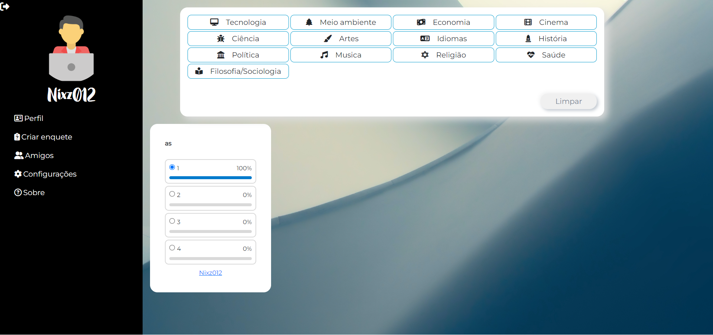
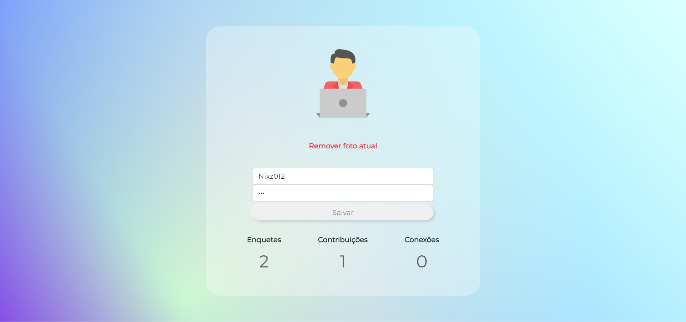
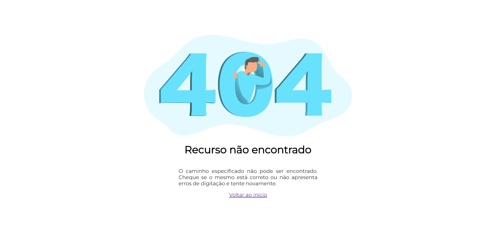

# SayUP


Main


Login


SignUp


Home




Profile




Error




# Getting Started


Install dependencies

```pip install -r requirements.txt```

Start server

```python manage.py runserver --insecure```