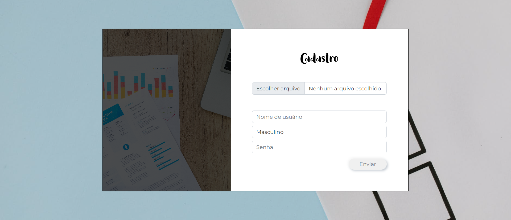

# User Interface


Main


Login


SignUp




Home


Profile

<<<<<<< HEAD


Error


# Getting Started

Install dependencies

```pip install -r requirements.txt```

Start server

```python manage.py runserver --insecure```
=======


Error


>>>>>>> 043c9606761fd66ba2c5954347a5d9ddf7ebd0f9
